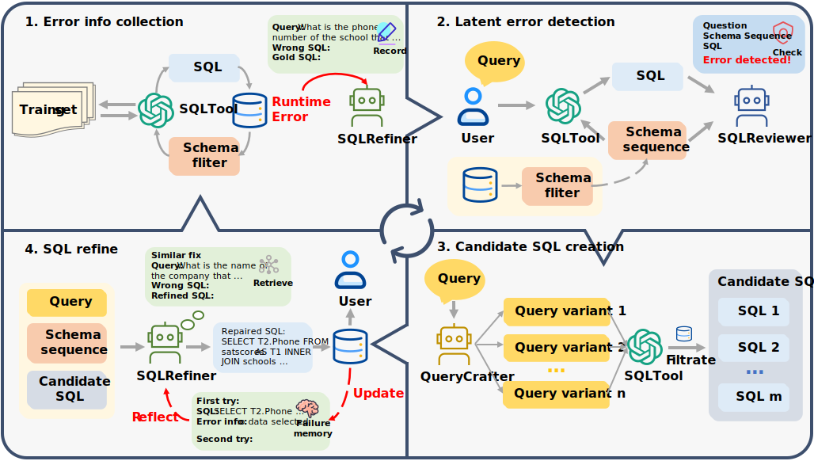

<h2 align="center"> <a href="https://arxiv.org/pdf/2406.13408">SQLFixAgent: Towards Semantic-Accurate Text-to-SQL Parsing via Consistency-Enhanced Multi-Agent Collaboration</a></h2>
<h5 align="center"> If you like our project, please give us a star ⭐ on GitHub for latest update.  </h2>



This repository contains the official implementation of our work in AAAI 2025. More details can be viewed in our paper. [[PDF]](https://arxiv.org/pdf/2406.13408)

## Abstract

While fine-tuned large language models (LLMs) excel in generating grammatically valid SQL in Text-to-SQL parsing, they often struggle to ensure semantic accuracy in queries, leading to user confusion and diminished system usability. To tackle this challenge, we introduce SQLFixAgent, a new consistency-enhanced multi-agent collaborative framework designed for detecting and repairing erroneous SQL. Our framework comprises a core agent, SQLRefiner, alongside two auxiliary agents: SQLReviewer and QueryCrafter. The SQLReviewer agent employs the rubber duck debugging method to identify potential semantic mismatches between SQL and user query. If the error is detected, the QueryCrafter agent generates multiple SQL as candidate repairs using a fine-tuned SQLTool. Subsequently, leveraging similar repair retrieval and failure memory reflection, the SQLRefiner agent selects the most fitting SQL statement from the candidates as the final repair. We evaluated our proposed framework on five Text-to-SQL benchmarks. The experimental results show that our method consistently enhances the performance of the baseline model, specifically achieving an execution accuracy improvement of over 3\% on the Bird benchmark. Our framework also has a higher token efficiency compared to other advanced methods, making it more competitive.

## Citation
If you find this work useful, please consider citing it.
```bibtex
@inproceedings{cen2025sqlfixagent,
  author = {Jipeng Cen and Jiaxin Liu and Zhixu Li and Jingjing Wang},
  title = "SQLFixAgent: Towards Semantic-Accurate Text-to-SQL Parsing via Consistency-Enhanced Multi-Agent Collaboration",
  booktitle = "AAAI",
  year = "2025"
}
```
