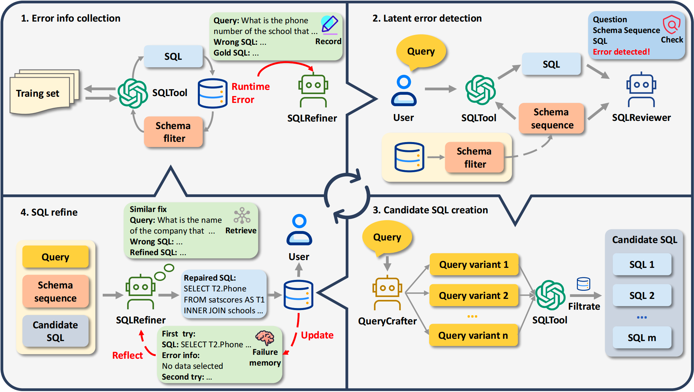

<h2 align="center"> <a href="https://ojs.aaai.org/index.php/AAAI/article/view/31979">SQLFixAgent: Towards Semantic-Accurate Text-to-SQL Parsing via Consistency-Enhanced Multi-Agent Collaboration</a></h2>
<h5 align="center"> If you like our project, please give us a star ⭐ on GitHub for latest update.  </h2>


This is the official implementation of the paper "SQLFixAgent: Towards Semantic-Accurate Text-to-SQL Parsing via Consistency-Enhanced Multi-Agent Collaboration" (AAAI 2025).

If this repository could help you, please cite the following paper:
```
@inproceedings{cen2025sqlfixagent,
  author = {Jipeng Cen and Jiaxin Liu and Zhixu Li and Jingjing Wang},
  title = "SQLFixAgent: Towards Semantic-Accurate Text-to-SQL Parsing via Consistency-Enhanced Multi-Agent Collaboration",
  booktitle = "AAAI",
  year = "2025"
}
```

## Prepare Environments
Our experiments are conducted in the following environments:
- GPU: 8 * NVIDIA RTX3090 with 24GB VRAM, CUDA version 11.8
- Python Environment: Anaconda3, Python version 3.8.5

### Step1: Create Python Environments
Create a new Anaconda environment and install the required modules:
```
conda create -n sqlfixagent python=3.8.5
conda activate sqlfixagent
conda install pytorch==1.13.1 pytorch-cuda=11.7 -c pytorch -c nvidia
pip install -r requirements.txt
git clone https://github.com/lihaoyang-ruc/SimCSE.git
cd SimCSE-main
python setup.py install
cd ..
```

### Step2: Set OpenAI API :

```
vim ./core/api_config.py
```

### Step3: Download Datasets and Checkpoints

a. Download the necessary datasets [data.zip](https://drive.google.com/file/d/1-24BgxgyRRroZkTJ9tpF3jmTggvj7fZp/view?usp=drive_link), the schema item classifier checkpoints [sic_ckpts.zip](https://drive.google.com/file/d/1V3F4ihTSPbV18g3lrg94VMH-kbWR_-lY/view?usp=sharing). Then, unzip them using the following commands:
```
unzip data.zip
unzip sic_ckpts.zip
```

b. Download SFT-LLM checkpoints to be evaluated: [codes-3b-bird-with-evidence](https://huggingface.co/seeklhy/codes-3b-bird-with-evidence), [codes-7b-bird-with-evidence](https://huggingface.co/seeklhy/codes-7b-bird-with-evidence), [codes-3b-spider](https://huggingface.co/seeklhy/codes-3b-spider), [codes-7b-spider](https://huggingface.co/seeklhy/codes-7b-spider)and place them under the ./model folder.

c. Download [simsce model](https://huggingface.co/princeton-nlp/sup-simcse-roberta-base) and place it under the ./model folder.

### Step4: Pre-process data

You can skip this step as the pre-processed datasets are already included in the aforementioned `data.zip` file. However, if you wish to reproduce our data pre-processing procedure, you can install Java :

```
apt-get update
apt-get install -y openjdk-11-jdk
```

Then, execute the following two Python scripts:

```
# build BM25 index for each database
python -u build_contents_index.py
# pre-process dataset
python -u prepare_sft_datasets.py
```
Please note that this process may take a considerable amount of time (approximately 1-2 hours). 

## Run Inference
```
bash run.sh
```

run.sh includes two script: 

**run_sqltool.py** uses **CodeS** to generate SQL

**run_fix.py** uses a LLM API and **CodeS** to detect and fix errors from the previous stage.

## Note

The program will save the filtered schema to ./data/temp if it is not exist,  delete it for full running of code. 

Besides, the program will save the SQLTool error log to ./core/memory if it is not exist, by using [codes-3b](https://huggingface.co/seeklhy/codes-3b) to simulate runtime error collection on the training set, which can be time-consuming.

## Acknowledgements
We would thanks to official team of Bird for their help in evaluating our method on Bird's test set. We would also thanks to MAC-SQL ([paper](https://aclanthology.org/2025.coling-main.36/), [code](https://github.com/wbbeyourself/MAC-SQL)), Codes ([paper](https://arxiv.org/abs/2402.16347), [code](https://github.com/RUCKBReasoning/codes)), Bird ([paper](https://arxiv.org/pdf/2305.03111), [dataset](https://github.com/AlibabaResearch/DAMO-ConvAI/tree/main/bird)), Spider ([paper](https://arxiv.org/abs/1809.08887), [dataset](https://yale-lily.github.io/spider)), Spider-DK ([paper](https://arxiv.org/abs/2109.05157), [dataset](https://github.com/ygan/Spider-DK)), Spider-Syn ([paper](https://arxiv.org/abs/2106.01065), [dataset](https://github.com/ygan/Spider-Syn)), Spider-Realistic ([paper](https://arxiv.org/abs/2010.12773), [dataset](https://doi.org/10.5281/zenodo.5205322)) for their interesting work and open-sourced code and dataset.